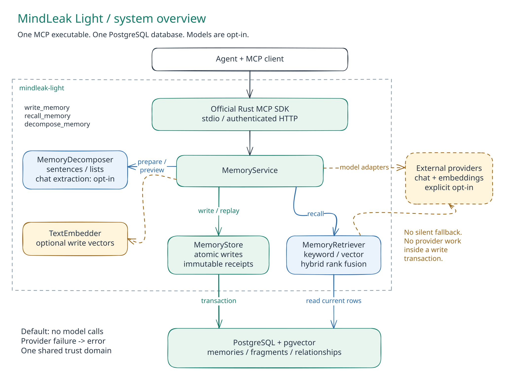
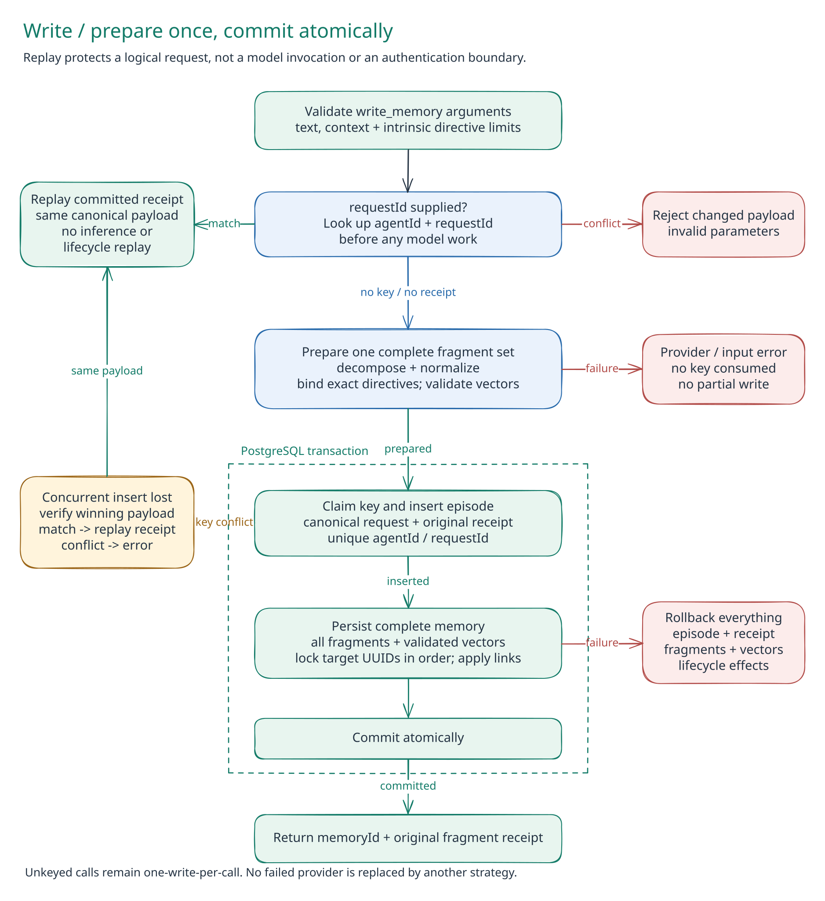
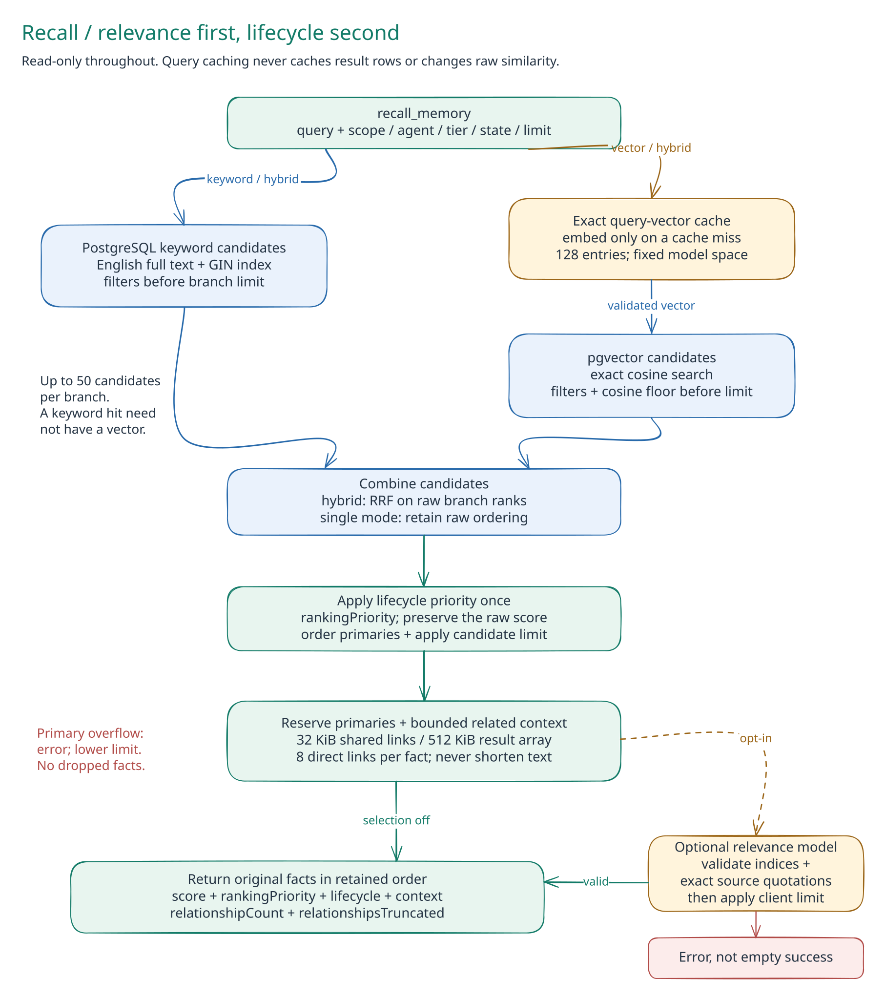
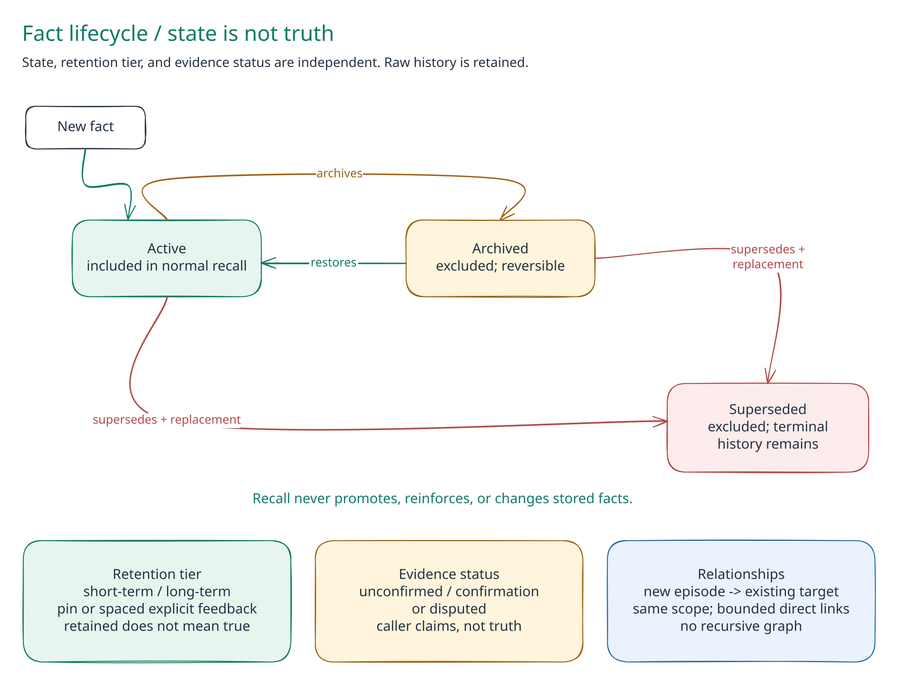

# Architecture

One executable exposes three MCP tools over one PostgreSQL database. Models are
optional. The default preserves source text and uses sentence/list decomposition
with keyword recall.

This guide describes the development source. Knowledge formation, domain records,
bounded migrations and administrative backups are not in published v0.5.0.
See [installation](INSTALL.md) for release availability. The existing memory-engine
diagrams are editable in the [architecture board](../assets/architecture.excalidraw);
the optional knowledge flow is shown separately below.

## Local and Shared Access

`local setup` creates a network-isolated trial and a persistent volume. `connect`
attaches the selected store; missing files never cause a replacement database.
`agent setup` installs instructions and skills, not permissions or a connection.

All MCP transport uses the official Rust SDK. Shared HTTP requires bearer
authentication and TLS at network ingress. The optional native loopback bridge
has separate host/origin guards and is refused in Linux containers.
See [local access](LOCAL.md) and [security](../SECURITY.md).

## Storage Module Map

Three tables serve all workflows. `memories` preserves source episodes, retry
receipts, domain entities and immutable knowledge revisions. `fragments` holds
source facts and optional vectors. `relationships` holds explicit fact links or
domain edges; their semantics remain separate.

The unreleased [domain](DOMAIN-RELATIONSHIPS.md) and [knowledge](CHAINS.md)
extensions add explicit MCP modes, not tools or default behavior. Chains reference
observations; principles pin validated chain revisions. Derived records remain
excluded from ordinary recall. See [ADR-0020](../adr.d/0020-domain-relationships.md)
and [ADR-0022](../adr.d/0022-opt-in-chains-of-memory.md).

The PostgreSQL crate keeps its existing public store/retriever names at the crate
root. Internal modules separate responsibilities; retry receipts stay in the
existing store rather than a parallel persistence path:

| Module | Responsibility |
|---|---|
| [lib.rs](../crates/mindleak-storage-postgres/src/lib.rs) | Store types and public retriever re-exports |
| [connection.rs](../crates/mindleak-storage-postgres/src/connection.rs) | TLS, pooling, detached migration connection, model binding, and health |
| [migrations.rs](../crates/mindleak-storage-postgres/src/migrations.rs) | Bounded checkpointed backfills, maintenance limits, index recovery, and pre-readiness schema verification (unreleased) |
| [domain.rs](../crates/mindleak-storage-postgres/src/domain.rs) | Indexed entity resolution, atomic domain edges, bounded directional windows and physical source/provenance verification |
| [persistence.rs](../crates/mindleak-storage-postgres/src/persistence.rs) | Validated atomic writes, request-key arbitration, and immutable receipt lookup/replay |
| [queries.rs](../crates/mindleak-storage-postgres/src/queries.rs) | Filtered SQL searches and result decoding |
| [retrieval.rs](../crates/mindleak-storage-postgres/src/retrieval.rs) | Keyword/vector/hybrid strategies, query cache, and rank fusion |
| [lifecycle.rs](../crates/mindleak-storage-postgres/src/lifecycle.rs) | Explicit feedback updates, final snapshot, activation priority, and context allocation |
| [relationships.rs](../crates/mindleak-storage-postgres/src/relationships.rs) | Shared indexed evidence windows, exact raw-source inspection, and keyset pagination |
| [documents.rs](../crates/mindleak-storage-postgres/src/documents.rs) | Bounded same-episode context and shared context-budget allocation |
| [chains.rs](../crates/mindleak-storage-postgres/src/chains.rs) | Chain/principle revisions, lineage, counterevidence, pgvector/keyword search and snapshot inspection |
| [knowledge.rs](../crates/mindleak-storage-postgres/src/knowledge.rs) | Final knowledge hydration, paged direct dependents and review queues |

## Administrative Backups

The unreleased [backup interface](BACKUP.md) is a separate CLI path in the same
executable, not another MCP tool or table. Capture reads PG maintenance utilities
without schema initialization; restore canaries use the explicit read-only store
connection. Format, ownership, and release gates are in
[ADR-0021](../adr.d/0021-encrypted-administrative-backups.md).

## Write

The unreleased startup path commits bounded migration batches before serving.
Checkpoints live in comments on the derived columns, not a fourth table.
The optional candidate-runtime canary manifest is read-only and runs through the
official MCP SDK before external readiness. See [database upgrades](MIGRATIONS.md)
and [ADR-0019](../adr.d/0019-bounded-resumable-migrations.md).

1. Validate input and look up a retained `requestId` before calling models.
2. Decompose the exact source. If enabled, prepare and validate every vector.
3. Commit source, fragments, explicit effects and original receipt together.
4. Return success only after commit. A retry with unchanged arguments replays
   that receipt; a changed payload fails.

Model work holds no database transaction. Failures never fall back to another
strategy. Atomic storage protects completeness, not the truth or semantic
accuracy of extracted prose. See [retry safety](../adr.d/0011-idempotent-memory-writes.md).

## Knowledge Formation

1. Preserve observations and their exact sources.
2. Preview candidate chains, optionally using a configured model.
3. Check evidence, run validation and explicitly accept a chain revision.
4. Form principles from validated chains, retaining the exact supporting revisions.
5. Challenge changed beliefs, review dependents and validate revisions again.
6. Retrieve or export knowledge with its sources and counterevidence.

`decompose_memory.formation` previews candidates without storing them. Exact
citations and source IDs are checked; conclusions still need validation.
`write_memory.chain` records proposal, acceptance, challenge, revision or retirement.
Principles reference chains, never other principles. This bounded hierarchy
prevents cycles without recursive graph reasoning.

`recall_memory.knowledge` returns principles first, then chains, with independent
observations still available. Knowledge and its references share a final read-only
snapshot after provider work; observations use their normal separate snapshot.
Changed support sets `requiresReview` without rewriting historical acceptance.
Revisions retain direct and inherited counterexamples.

Export is a bounded JSON/Markdown projection, not a model rewrite or server file
write. Ordinary memory calls remain unchanged and exclude derived episodes.
See [workflow and limits](CHAINS.md) and [ADR-0022](../adr.d/0022-opt-in-chains-of-memory.md).

## Provider Responses

- Provider bodies are bounded to 4 MiB before parsing. Partial or invalid output
	fails; text and response bodies are never logged.
- Reported embedding model IDs must match the configured space. No mixed models,
	dimension changes or fake vectors are accepted.
- SDK cancellation drops pending work, but cannot undo a commit already sent.

See [provider setup](MODELS.md) and [cancellation semantics](../adr.d/0013-cancellation-and-recall-snapshots.md).

## Recall

`MemoryRetriever` owns query-to-result behavior. All reads are side-effect free.

| Strategy | What It Does |
|---|---|
| Keyword, default | English PostgreSQL full-text search with a GIN index |
| Vector | Exact pgvector cosine search over stored vectors |
| Hybrid | Fuse up to 50 candidates per branch; preserve distinct records |

Vector queries share a bounded 128-entry embedding cache, never a result cache.
Filters and current evidence are reread. A configured cosine floor affects only
the semantic branch; it is not a truth probability. Optional relevance selection
chooses existing candidates by exact quotation without rewriting their scores.
Provider failures remain errors, not unfiltered fallback results.

Lifecycle priority is separate from the original retrieval score. Bounded source
and relationship context is read in a consistent snapshot; missing candidates
are not refilled. The caller checks applicability and synthesizes an answer.
See [retrieval design](../adr.d/0007-hybrid-recall-and-calibrated-relevance.md),
[cache behavior](../adr.d/0009-fast-recall-and-optional-model-controls.md) and
[relevance limits](../adr.d/0008-bounded-model-relevance-selection.md).

### Document Recall

The text index combines fragment wording with lower-weight source metadata.
`matchMode` controls keyword parsing; `diagnostics` shows the parsed query.
`contextLimit` adds nearby source fragments without turning them into scored hits.
`groupDuplicates` groups identical returned text while preserving each source.

None of these controls merges stored evidence or changes vectors. Unknown order
and omitted context are explicit. See [document controls](INTEGRATION.md#document-recall-controls).

### Source Inspection

`fragmentId` without `query` reads the exact source and a bounded evidence page,
without model calls. Follow `nextCursor` even through empty filtered pages.
Each page is a new snapshot; a cursor does not reserve history.
See [source inspection](INTEGRATION.md#inspect-original-sources).

## Contextual Fact Lifecycle

State, retention tier, and evidence status are separate concepts. A fact starts
active; short/long-term tiers affect activation, not truth. Superseded is terminal,
while archived is reversible. A replacement is a new fact committed with its
supersedes link. Confirmation is a caller-reported claim; recall is never feedback.

Explicit links stay in the same optional scope. Locks and session uniqueness
protect concurrent feedback; new source, links and effects commit together.
Spaced confirmation and demonstrated usefulness are separate claims. Neither
retention nor repeated agreement establishes truth.

See [the lifecycle guide](LIFECYCLE.md), [ranking and budgets](../adr.d/0012-bounded-recall-context.md),
and [bounded evidence reads](../adr.d/0014-bounded-evidence-inspection.md).

## Storage and Deployment

One bounded connection pool serves the MCP process. A detached maintenance
connection serializes migrations, applies timeout budgets and checkpoints large
backfills. Startup verifies required columns/indexes and optional operator
canaries before readiness. See [migration operations](MIGRATIONS.md).

Knowledge migration `0010` adds nullable revision metadata and document vectors;
old source records stay ordinary. Initial DDL/index construction can still need
a maintenance window. Old servers cannot safely read derived records: roll back
by restoring a pre-upgrade backup, not by mixing server versions.

One database has one embedding model and dimension. Model-free writes may coexist
as null vectors; changing the configured vector space is refused. Nothing is
implicitly re-embedded. Scope and agent IDs are filters, not authentication.

### Backup and Recovery

Administrative backups use `pg_dump` and record fingerprints from the same
exported snapshot, then encrypt with restic. Fingerprints cover complete rows,
schema, indexes, triggers, model binding and declared source assets, including
knowledge revisions, vectors and receipts. Relationship tie-breaking is stable
for both fact links and domain edges.

Verification restores into a new database before comparing fingerprints. Read-only,
model-free MCP canaries inspect ordinary sources and knowledge separately; a
derived fragment is never sent through ordinary source inspection. Verification
does not migrate, accept beliefs or switch the working service. Keep the matching
engine and key with the recovery plan. See [backup operations](BACKUP.md).

### Bounds

| Boundary | Limit |
|---|---|
| Source text / fragment | 32 KiB / 4 KiB |
| Fragments per write / ordinary recall | 64 / 50 |
| Knowledge results / direct supports | 10 / 8 |
| Formation input / output candidates | 128 KiB / 3 |
| Expanded context / complete payload | 32 KiB / 512 KiB |

Bounds are serialized UTF-8 bytes, not tokens. Truncation flags retain references
and identify omitted details. These bounds do not establish large-corpus capacity.

## Distribution

Native release archives contain the one MCP executable, connection template,
install guides, and checksums. They use an external PostgreSQL/pgvector database.
No host language runtime is needed to run the binary.

The `all-in-one` Docker target packages the same executable with PostgreSQL and
Supervisor. PostgreSQL is socket-only inside the container; the HTTP MCP server
is token-authenticated. A named volume holds database data. The supervisor owns
process startup/restarts/shutdown, not memory orchestration or agent coordination.
The `app` target and two-service source Compose setup remain available.

See [ADR-0006](../adr.d/0006-native-and-all-in-one-distribution.md) and
[installation](INSTALL.md). Docker Hub publishing targets
`monkeemagic/mindleak-light` and requires an explicit manual release-tag run.

## Origin

Adapted from MindLeak's Cargo workspace, OpenAI-compatible consolidation and
embedding clients, batch-vector validation, `deadpool-postgres` pool pattern,
and knowledge-store pgvector queries. Repo processes retain its ADR, changelog,
hook, review, and release conventions. No sibling crate is linked or required.

The user-facing [quickstart](../README.md#quickstart), [integration guide](INTEGRATION.md),
and [model setup](MODELS.md) are the supported entry points. See
[ADR-0005](../adr.d/0005-optional-models-and-model-free-quickstart.md) for the explicit
model-free default and optional-provider contract.
