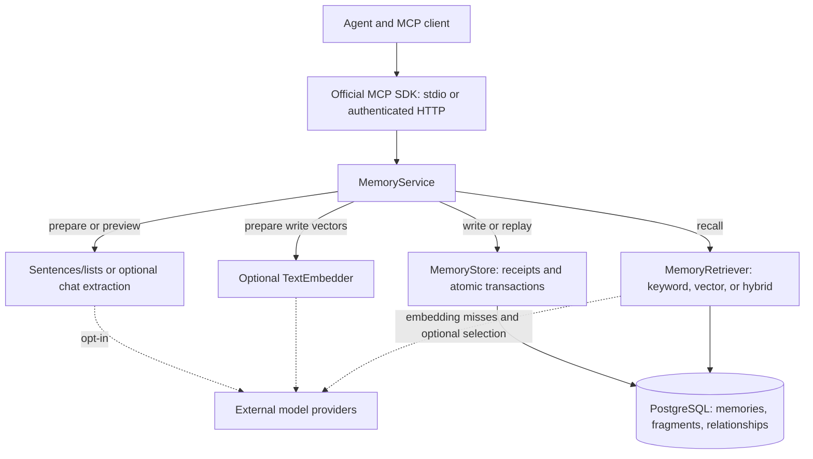
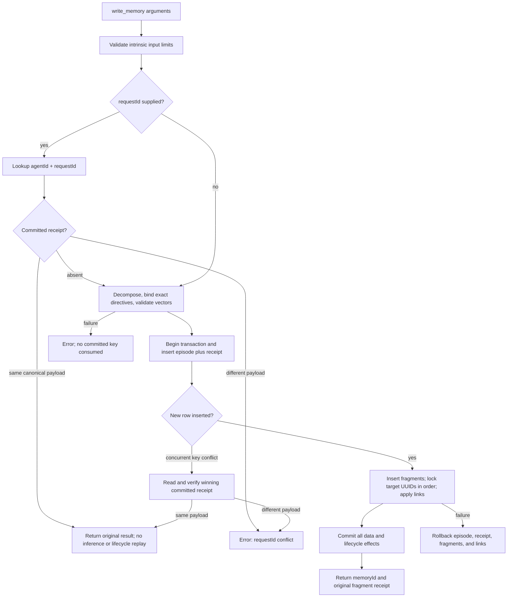
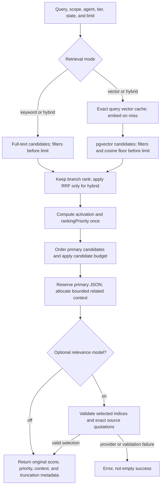
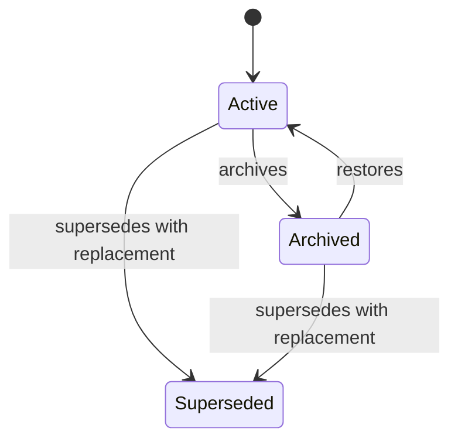

# Architecture

This describes the integrated source: v0.2.0 contextual fact lifecycle, hybrid
recall, cached query embeddings, and provider safeguards, plus unreleased
retry-safe writes, modular storage, response budgets, and ranking diagnostics.
See [installation](INSTALL.md) for packages and upgrade requirements.

## Storage Module Map

The PostgreSQL crate keeps its existing public store/retriever names at the crate
root. Internal modules separate responsibilities; retry receipts stay in the
existing store rather than a parallel persistence path:

| Module | Responsibility |
|---|---|
| [lib.rs](../crates/mindleak-storage-postgres/src/lib.rs) | Store types and public retriever re-exports |
| [connection.rs](../crates/mindleak-storage-postgres/src/connection.rs) | TLS, pooling, schema initialization, model binding, and health |
| [persistence.rs](../crates/mindleak-storage-postgres/src/persistence.rs) | Validated atomic writes, request-key arbitration, and immutable receipt lookup/replay |
| [queries.rs](../crates/mindleak-storage-postgres/src/queries.rs) | Filtered SQL searches and result decoding |
| [retrieval.rs](../crates/mindleak-storage-postgres/src/retrieval.rs) | Keyword/vector/hybrid strategies, query cache, and rank fusion |
| [lifecycle.rs](../crates/mindleak-storage-postgres/src/lifecycle.rs) | Explicit feedback updates, activation priority, and bounded relationship reads |

## Write

Validate input and decompose it using the configured strategy. The default uses
Unicode sentence boundaries and line/list boundaries, preserving the wording.
Optional model mode requests self-contained claims in structured JSON output;
schema validation cannot prove their semantic fidelity. Normalize
whitespace and remove exact duplicates. If vector or hybrid retrieval is enabled,
embed the batch and validate ordering and vector shape before opening a transaction.

Insert the exact raw memory followed by every fragment, using NULL for disabled
embeddings. Commit, then return the memory ID. Enabled model work happens before
the transaction so inference does not hold database connections. No failed
provider call is replaced with another strategy.

With a client `requestId`, validate intrinsic input constraints and look up a
committed receipt before model work. The key is a UUID scoped by `agentId`, not
an authentication boundary. A matching canonical request replays its immutable
write result. Changed text, context, or directives fail with invalid parameters.
Typed defaults are normalized; raw text and ordered directive/link lists remain
part of identity. Requests without a key retain the original write-per-call
behaviour.

The `memories` insert stores the canonical typed request and original result in
the same transaction as all fragments, vectors, and lifecycle effects. A partial
unique index on `(agent_id, request_id)` arbitrates concurrent inserts. A losing
insert reads and verifies the committed payload, returning its receipt without
inserting fragments or reapplying relationships. No reservation or database lock
is held during inference; simultaneous initial requests may duplicate model
work. Provider failures and rolled-back transactions do not consume a key.
See [ADR-0011](../adr.d/0011-idempotent-memory-writes.md).

Raw text is preserved exactly. Memory text is limited to 32768 UTF-8 bytes;
decomposition produces 1..64 fragments of at most 4096 bytes each. Empty facts,
truncated model responses, numerically unsafe vectors, and dimension mismatches
fail. Squared vector norms must be finite and normal in f32 so pgvector's cosine
arithmetic cannot underflow on accepted inputs. Non-finite database recall scores
are errors rather than successful results with a null score.

## Provider Responses

The `mindleak-provider` crate owns the shared `read_json_response` boundary used
by the decomposition, embedding, and relevance clients. It caps each provider
body at 4 MiB before JSON parsing, checking the declared length when available
and cumulative bytes while reading chunks. Oversized or broken responses fail
without truncation, response-body logging, or fallback to another strategy.
This shared HTTP boundary keeps transport concerns out of the memory domain.

When an embedding provider reports a non-null model ID, it must exactly match
the configured ID before vectors can be used for writes or queries. Providers
that omit that metadata remain supported, but their actual identity cannot be
verified. Model aliases are not resolved implicitly, and stable model names still
cannot prove that a provider has kept its weights unchanged.

## Recall

The relevance wrapper requests at least its configured candidate count from the
underlying retriever, then filters to the client limit without refilling omitted
related context. All recall paths are read-only. The cache stores only vectors;
current database data and lifecycle filters are always re-evaluated.

`MemoryRetriever` owns the query-to-results boundary. `KeywordMemoryRetriever`
uses PostgreSQL's English text-search configuration, `websearch_to_tsquery`, and
normalized `ts_rank_cd`, with a GIN expression index. It searches all fragments.
Use short keyword queries; unrelated synonyms are not inferred.

Optional `VectorMemoryRetriever` embeds the query and orders fragments with
vectors by PostgreSQL's cosine-distance operator. NULL embeddings are excluded,
not filled with fake vectors. Both paths filter by agent before limiting. Vector
search is exact and has no approximate-vector index yet.

Vector/hybrid retrievers keep an in-process FIFO cache of at most 128 exact-query
slots, including unfinished initializations. Each slot uses a Tokio `OnceCell`
to share a successful embedding calculation between overlapping callers; only
validated vectors populate the cell. Query keys preserve case and whitespace.
Cache hits skip embedding inference, not database recall: current rows and agent,
scope, state, and tier filters are always checked.

A failed initializer returns its error without populating the cell. A waiting or
later caller can make its own attempt after a failure or cancellation; the failed
call is not retried internally. Different query strings initialize independently.
FIFO eviction uses the slot's insertion order, and an evicted in-flight slot can
lead to another calculation if that query arrives again. Uninitialized slots
remain bounded by the same capacity and can be retried or evicted. The cache
belongs to one fixed model/dimension space and is cleared on process exit.
Hybrid keyword lookup runs concurrently with the vector path. The cache mutex
is released before inference or awaiting a cell. See
[ADR-0009](../adr.d/0009-fast-recall-and-optional-model-controls.md).

`MINDLEAK_RECALL_MIN_SIMILARITY` optionally filters vector candidates by cosine
similarity before limiting. It must be finite and in [-1, 1]; unset/-1 is
unfiltered. Calibrate it for the actual model and corpus rather than treating
cosine as confidence. Empty recall results are valid.

Optional `HybridMemoryRetriever` gets up to fifty candidates from each existing
search path and fuses them by fragment ID with reciprocal rank fusion (constant
60). It normalizes by the maximum score of two top-ranked matches, sorts by
fused score then fragment UUID, and applies the requested limit. A keyword hit
can survive without an embedding or below the cosine floor; the floor gates the
semantic branch only. Different facts from one memory remain distinct. Enabled
provider failures are propagated, never hidden behind keyword results.
See [ADR-0007](../adr.d/0007-hybrid-recall-and-calibrated-relevance.md).

`MINDLEAK_RELEVANCE=openai` optionally wraps any candidate retriever with
`OpenAiRelevanceRetriever`. It asks a configured model to select existing
fragment indices with exact evidence quotations, never to generate a recalled fact.
It validates each quotation against the corresponding stored candidate, without
claiming that source presence proves relevance. It preserves selected
text, provenance, scores, and original order, then applies the caller's limit.
The candidate budget is 20 by default (1..50), raised to at least the requested
limit. Query plus candidate text must fit 32768 UTF-8 bytes or recall fails;
fragments are not truncated. Empty candidate lists skip inference. Invalid
indices, duplicate candidates, scope violations, truncated replies, and provider
failures are errors, not successful empty recalls. The default is `off`.
See [ADR-0008](../adr.d/0008-bounded-model-relevance-selection.md).

The client agent performs synthesis from returned fragments and their provenance.
Replacing the retriever does not change the MCP tools or write pipeline. RAST
is an interface extension point, not a shipped implementation.

## Contextual Fact Lifecycle

State, retention tier, and evidence status are separate concepts. A fact starts
active; short/long-term tiers affect activation, not truth. Superseded is terminal,
while archived is reversible. A replacement is a new fact committed with its
supersedes link. Confirmation is a caller-reported claim; recall is never feedback.

The source episode stores optional scope, session ID, source, and summary as
bounded context. Fragments have independent short/long-term retention, state,
evidence status, salience, pin, and feedback timestamps/counters. The lifecycle
never copies facts into another database or replaces pgvector embeddings.

Writes can explicitly relate each new fragment to existing fragments in the same
scope. SQL target locks and a feedback-session unique index protect concurrent
updates; the episode, links, vectors, and lifecycle changes commit together.
Confirmation and usefulness are separate feedback types. Consolidation only runs
on new feedback with a demonstrated time span, never as a side effect of recall.
Correction, archive, and restore are evidence-linked writes retaining history.

Context, tier, agent, and state filters enter the keyword/vector SQL before
candidate selection. Lifecycle priority is computed once after candidate search
or hybrid fusion, discounting low activation by at most 25% while preserving the
original score. The response exposes this final value as `rankingPriority`, not
a probability of relevance or truth. Exact pgvector cosine remains the semantic
query. Read at most eight direct related references per final result, subject
to a shared 32 KiB serialized relationship-array budget. Reserve primary results
first and allocate related objects round-robin in primary ranking order, retaining
each owner's existing relationship-type/UUID order. `relationshipCount` reports
eligible links and `relationshipsTruncated` reports omitted context. Never truncate
text or drop primary facts for link expansion. The result array is limited to
512 KiB; if primaries alone exceed it, recall fails and asks for a lower limit.
These limits measure serialized UTF-8 JSON, including escaping, not token counts.
MCP adds its envelope and text/structured representations separately.
There is no graph traversal. Optional relevance inference receives the context
but still must quote the selected fact itself as evidence.

See [ADR-0010](../adr.d/0010-contextual-fact-lifecycle.md) for precise policies
and [the lifecycle guide](LIFECYCLE.md) for the human-facing contract.
Response budgeting and priority disclosure are specified in
[ADR-0012](../adr.d/0012-bounded-recall-context.md).

## Storage and Deployment

The Postgres crate owns one bounded pool, shared by all server clones. Startup
serializes idempotent schema initialization with a transaction-scoped advisory
lock. Catalog checks skip already-applied column changes and existing indexes,
so restarting against a current schema does not take migration locks that block
normal readers or writers. A fresh installation or actual schema upgrade still
requires DDL permissions and can wait for active transactions.

The original schema remains unchanged; the explicit
[optional-embedding migration](../crates/mindleak-storage-postgres/migrations/0002-optional-embeddings.sql)
relaxes nullability and adds the keyword index. Existing data is not rewritten.

The [lifecycle migration](../crates/mindleak-storage-postgres/migrations/0003-fact-lifecycle.sql)
adds metadata columns, context, typed relationship actions, and feedback uniqueness.
Existing facts default to short-term/active/unconfirmed with creation-time activation;
their raw text, identities, relationships, and vector types/values are preserved.

The [retry-safety migration](../crates/mindleak-storage-postgres/migrations/0004-idempotent-writes.sql)
adds nullable request ID, canonical payload, and result columns plus the unique
key and all-or-none metadata constraint to `memories`. Existing rows stay unkeyed;
no legacy IDs, fragments, vectors, or lifecycle metadata are rewritten. Receipts
last as long as their memory row, including while facts are archived or superseded.
Changes to the canonical request representation need an explicit compatibility
decision so future upgrades do not silently change request identity.

Model-free startup does not bind or require an embedding model. On first vector
or hybrid startup, model and dimensions are recorded in the fragments table
comment; the empty vector column can adopt that dimension. Later mismatches refuse startup.
Model-free processes can still read/write NULL-vector fragments in that database.
There is no automatic re-embedding of earlier entries.

Relationships have constrained types, foreign keys, and cascade cleanup but no
automatic inference. `agent_id` records provenance in a shared trust domain.
It is not a tenant key. There is no user table, queue, migration ledger, scheduler,
or background consolidation service.

The Compose file is local development, not an internet-facing production
topology. Production uses the same binary with protected HTTP ingress and a
TLS-verified Postgres connection. See [SECURITY.md](../SECURITY.md).

## Distribution

Native release archives contain the one MCP executable, connection template,
install guides, and checksums. They use an external PostgreSQL/pgvector database.
No host language runtime is needed to run the binary.

The `all-in-one` Docker target packages the same executable with PostgreSQL and
Supervisor. PostgreSQL is socket-only inside the container; the HTTP MCP server
is token-authenticated. A named volume holds database data. The supervisor owns
process startup/restarts/shutdown, not memory orchestration or agent coordination.
The `app` target and two-service source Compose setup remain available.

See [ADR-0006](../adr.d/0006-native-and-all-in-one-distribution.md) and
[installation](INSTALL.md). Docker Hub publishing targets
`monkeemagic/mindleak-light` and requires an explicit manual release-tag run.

## Origin

Adapted from MindLeak's Cargo workspace, OpenAI-compatible consolidation and
embedding clients, batch-vector validation, `deadpool-postgres` pool pattern,
and knowledge-store pgvector queries. Repo processes retain its ADR, changelog,
hook, review, and release conventions. No sibling crate is linked or required.

The user-facing [quickstart](../README.md#quickstart), [integration guide](INTEGRATION.md),
and [model setup](MODELS.md) are the supported entry points. See
[ADR-0005](../adr.d/0005-optional-models-and-model-free-quickstart.md) for the explicit
model-free default and optional-provider contract.
